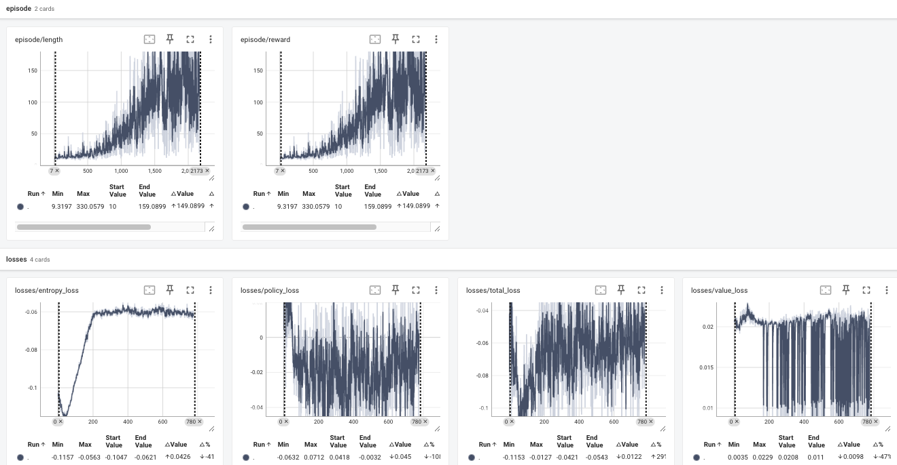

# A2C with GAE

This exercise implements a Advantage Actor-Critic (A2C) with [GAE](https://arxiv.org/abs/1506.02438).
Optional: A2C with TD-n.

## Files


## Command
Train
```bash
# Train the model on CartPole-v1
python practice/cli.py --config practice/exercise5_a2c/config_cartpole.py
```

Play with trained model and generate video
```bash
python practice/cli.py --config practice/exercise5_a2c/config_cartpole.py --mode play
```

Push to hub
```bash
# generate video and push to hub
python practice/cli.py --config practice/exercise5_a2c/config_cartpole.py --push_to_hub --username myuser

# only push to hub
python practice/cli.py --config practice/exercise5_a2c/config_cartpole.py --push_to_hub --username myuser --skip_play
```

Run the comprehensive test suite:
```bash
# Run all tests
python -m pytest practice/exercise5_a2c/tests/ -v
```

## Parameter Tuning
### CartPole
1. smaller learning_rate
2. schedule entropy_coef
3. add max_grad_norm
4. adjust value_loss_coef and entropy_coef
    - value_loss should converge
5. smaller hidden size
6. try different total_step: 100K, 1M, 200K, 150K
7. add nn.LayerNorm
8. add critic_lr and ExponentialLR scheduler
9. normalize the batch reward.
10. Bad try:
    - rollout_len 43 from 32
    - use a common ExponentialLR for value, policy and shared_layers.

The training log of a [mean_reward: 499.94, std_reward: 0.42]

